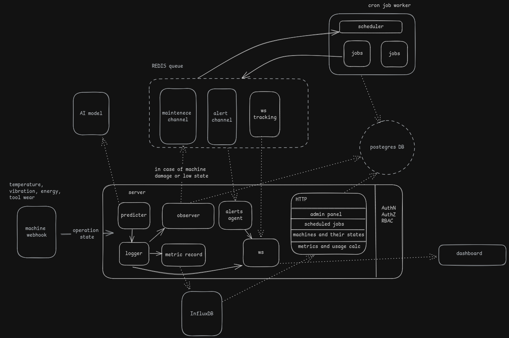

<h1 align="center">DevFest 2024 B.R.A.I.N 2nd Challenge: Smart Analytics Platform for Car Manufacturing Operations</h1>

<p align="center">
  
</p>

## Overview
The Smart Analytics Platform is a sophisticated monitoring and predictive maintenance system designed for car manufacturing operations. It combines real-time monitoring, AI-powered predictions, and automated maintenance scheduling to ensure optimal manufacturing performance and reduce downtime.

### explanation videos:

https://drive.google.com/file/d/1QiAB8Cv45ZtDS3_bFgW0FTSoHS4JOcCU/view?usp=drive_link

https://drive.google.com/file/d/1pqOwxWTvZxQOSLJSNB3HizGkTxXexs7x/view?usp=sharing

https://drive.google.com/file/d/1E6ZfF8D_4wYiQdcxbWL2OVIrU9637VA7/view?usp=sharing

**the env var in the frontend side should be https not http. thus u gotta use negrok**

## System Architecture

### Core Components
1. **Server Core**
   - Predictor Service: Leverages AI models for machine health prediction
   - Observer Service: Monitors real-time machine states
   - Logger: Records all system events and metrics
   - Alerts Agent: Handles critical notifications and warnings
   - WebSocket Service: Enables real-time communication

2. **Data Stores**
   - PostgreSQL: Primary database for system configuration and user management
   - InfluxDB: Time-series database for metrics and performance data
   - Redis Queue: Message broker for inter-service communication

3. **Cron Job Worker**
   - Scheduler: Manages maintenance tasks and periodic checks
   - Job Processor: Executes scheduled maintenance tasks

4. **Frontend Interface**
   - Admin Panel: Configuration and system management
   - Dashboard: Real-time monitoring and analytics visualization
   - Authentication & Authorization: RBAC-based access control

### Data Flow
1. Machine data (temperature, vibration, energy, tool wear) is collected via webhooks
2. The Observer service processes incoming data and stores metrics
3. The Predictor service analyzes patterns using AI models
4. Alerts are generated for anomalies or maintenance needs
5. Maintenance tasks are automatically scheduled through the job queue
6. All metrics are stored in InfluxDB for analysis and visualization

## Installation Guide

### Prerequisites
- Node.js (v14 or higher)
- Docker and Docker Compose
- PM2 process manager
- Ngrok for webhook testing

### Setup Steps
1. **Initial Setup**
   ```bash
   cd server
   npm install
   ```
 
2. **Database Setup**
   ```bash
   # Start Docker containers
   docker compose --env-file .env up -d

   # Run migrations and seed data
   npm run db:migrate
   npm run db:seed
   ```

3. **InfluxDB Configuration**
   - Access InfluxDB interface at `localhost:8086`
   - Login credentials:
     - Username: admin
     - Password: admin password
   - Navigate to Node.js section → Get Token
   - Copy the INFLUXDB_TOKEN to your .env file

4. **Webhook Setup**
   ```bash
   # Start Ngrok tunnel
   ngrok http http://localhost:8080
   
   # Update CALLBACK_URL in .env with new Ngrok URL
   ```
5. **Environment Configuration**
   ```bash
   # Create .env file with required variables
   CALLBACK_URL=<ngrok_domain>/api/v1/webhook/consume
   # Add other environment variables
   ```


6. **Application Launch**
   ```bash
   pm2-runtime start ecosystem.config.cjs
   ```

## System Operation

### Monitoring Flow
1. **Data Collection**
   - Machine states are continuously monitored
   - Metrics include temperature, vibration, energy consumption, and tool wear

2. **Analysis & Prediction**
   - AI model processes incoming data
   - Predictive analytics identify potential issues
   - Real-time state assessment

3. **Maintenance Scheduling**
   - Automated job creation based on predictions
   - Tasks queued through Redis
   - Worker nodes process maintenance requests

4. **Reporting & Visualization**
   - Real-time metrics displayed on dashboard
   - Historical data analysis available
   - Custom report generation

### Alert Channels
- Maintenance Channel: Scheduled maintenance notifications
- Alert Channel: Critical system warnings
- WS Tracking: Real-time state monitoring

## Security & Access Control
- Authentication (AuthN)
- Authorization (AuthZ)
- Role-Based Access Control (RBAC)
- Secure WebSocket connections
- Encrypted data storage

## Scalability Features
- Redis-based message queuing
- InfluxDB for time-series data scaling
- Containerized deployment
- Modular architecture
- Horizontal scaling capability

## Monitoring & Maintenance
- Real-time performance metrics
- Automated health checks
- Predictive maintenance scheduling
- Historical data analysis
- System state logging


